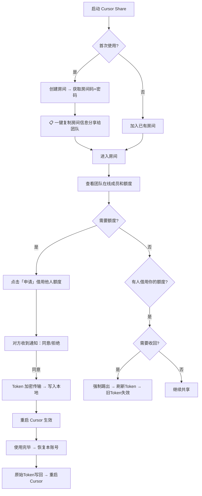
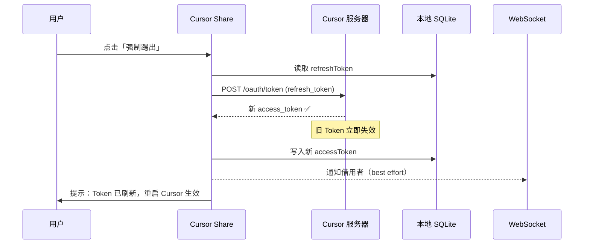

# Cursor Share

> 团队 Cursor AI 额度共享工具 — 让团队成员之间安全、高效地共享 Cursor 使用额度。

## ✨ 功能特性

### 🏠 房间隔离
- 创建独立房间，每个团队拥有私密的共享空间
- 房间码 + 密码双重验证，防止非授权访问
- 支持创建 / 加入 / 切换不同团队房间

### 🔐 端到端加密传输
- 借用者在发起申请时，在本地生成 RSA 密钥对
- 出借者使用借用者的**公钥加密** Token 后通过 WebSocket 传输
- 只有借用者持有的**私钥**才能解密，服务端和中间人均无法获取明文 Token

### 🔄 一键借用 / 归还
- **自动备份**：申请借用前自动保存你原始的 Token
- **自动恢复**：归还额度时一键恢复你的原始账号
- **无感切换**：重启 Cursor 即生效，无需重新登录

### �️ 强制踢出（Token 真实刷新）
- 调用 Cursor 官方 Token Refresh API 刷新 Token
- 旧 Token 在 **Cursor 服务器端立即失效**，即使借用者离线/关闭 App 也无法继续使用
- 在线时同步通知借用者恢复自己的账号
- 支持在房间内、托盘菜单等任意场景触发

### 📊 额度实时监控
- 实时展示团队成员剩余使用次数（每 5 分钟自动刷新）
- 手动刷新按钮随时查看最新额度
- 进度条可视化展示额度消耗情况

### 🖥️ 跨平台支持
- macOS（`.dmg` 安装包）
- Windows（`.exe` 安装包 / NSIS 安装向导）
- 托盘菜单常驻，不占任务栏空间

---

## 🔒 安全机制

Cursor Share 的核心设计原则是：**Token 绝不以明文经过任何第三方**。

```
┌──────────────────────────────────────────────────────────────────┐
│                       安全传输流程                                │
│                                                                  │
│  借用者（Alice）                    出借者（Bob）                  │
│  ─────────────────                ─────────────────              │
│  1. 生成 RSA 密钥对               5. 用 Alice 的公钥             │
│     publicKey + privateKey            加密自己的 Token            │
│                                                                  │
│  2. 发送申请 + publicKey ──────▶  收到申请                       │
│                                   3. 弹窗确认：同意/拒绝          │
│                                   4. 点击「同意」                 │
│                                                                  │
│  7. 用 privateKey 解密   ◀────── 6. 发送加密后的 Token           │
│  8. 写入本地 Cursor DB                                           │
│  9. 重启 Cursor 生效                                             │
│                                                                  │
│  ⚠️ 服务端只转发加密数据，无法解密 Token                          │
└──────────────────────────────────────────────────────────────────┘
```

### Token 生命周期管理

| 环节 | 安全措施 |
|---|---|
| **传输** | RSA 公钥加密，服务端不可见 |
| **存储** | Token 仅写入本地 SQLite，不上传服务器 |
| **服务端** | 纯内存运行，无数据库、不存储任何信息，重启即清空 |
| **备份** | 借用前自动备份原始 Token 到本地文件 |
| **回收** | 调用 Cursor 官方 API 刷新 Token，旧 Token 服务器端失效 |
| **恢复** | 一键恢复原始 Token，支持从托盘菜单触发 |

---

## 🔁 完整使用流程



### 强制踢出流程



---

## 🚀 快速开始

### 1. 启动后端服务

后端只需部署在**一台服务器**上（推荐使用云服务器，保证所有团队成员可访问）。

> 💡 后端是**纯信令转发服务**，无数据库、不存储任何用户数据，所有状态仅在内存中存在，服务重启即清空。

```bash
cd backend
npm install
npm start
```

启动后会显示 LAN 地址：
```
╔══════════════════════════════════════════════════════════════╗
║   Cursor Share Signaling Server  v2.0                       ║
║   LAN:    ws://192.168.1.100:8080                           ║
╚══════════════════════════════════════════════════════════════╝
```

### 2. 启动客户端

每个团队成员在自己电脑上执行：

```bash
cd frontend
npm install
npx -y @electron/rebuild   # 编译 better-sqlite3 原生模块
npm start
```

### 3. 连接使用

1. 在「服务器地址」输入框填入后端地址（如 `ws://120.48.12.81:8080`）
2. **创建房间**：输入团队名称 → 生成房间码和密码 → 一键复制分享给团队
3. **加入房间**：输入房间码 + 密码 → 进入房间
4. 查看团队成员在线状态和额度 → 发起借用申请

---

## 📦 打包分发

生成可分发的安装包：

```bash
cd frontend

# macOS
npm run dist:mac    # 生成 .dmg

# Windows
npm run dist:win    # 生成 .exe 安装包

# 同时打包所有平台
npm run dist
```

打包结果在 `frontend/dist/` 目录。

---

## 📁 项目结构

```
cursor-share/
├── backend/                  # WebSocket 信令服务器（无数据库，纯内存）
│   └── src/
│       ├── server.js            # 入口，WS 连接管理
│       ├── handlers.js          # 消息处理逻辑
│       ├── state.js             # 内存状态管理（不落盘）
│       ├── broadcast.js         # 广播工具
│       └── heartbeat.js         # 心跳检测
├── frontend/                 # Electron 桌面客户端
│   ├── main.js                  # 主进程（Tray, IPC, 窗口）
│   ├── preload.js               # 安全桥接（Context Bridge）
│   ├── renderer/
│   │   ├── index.html           # UI 结构
│   │   ├── styles.css           # 样式（暗色主题）
│   │   └── app.js               # 渲染进程逻辑
│   ├── lib/
│   │   ├── sqlite-ops.js        # SQLite CRUD + Token 备份/恢复
│   │   └── cursor-api.js        # Cursor API（额度查询 + Token 刷新）
│   └── assets/                  # 图标资源 (.png, .icns)
└── README.md
```

---

## 💻 系统要求

- **Node.js** ≥ 18
- **Cursor** 已安装并登录
- 团队成员可以访问到后端服务器（同一局域网或公网服务器）

---

## ❓ 常见问题

**Q: Windows 上 `npm install` 报错？**
A: 需要安装 C++ 编译工具：`npm install --global windows-build-tools`

**Q: 启动时提示"数据库文件不存在"？**
A: 确保已安装并登录过 Cursor。数据库路径：
- macOS: `~/Library/Application Support/Cursor/User/globalStorage/state.vscdb`
- Windows: `%APPDATA%\Cursor\User\globalStorage\state.vscdb`

**Q: 连接不上服务器？**
A: 检查防火墙是否允许 8080 端口；如果使用云服务器，确认安全组已开放端口。

**Q: 强制踢出后借用者还能用吗？**
A: 不能。强制踢出会调用 Cursor 官方 API 刷新你的 Token，旧 Token 在 Cursor 服务器端直接失效，无论借用者在不在线都无法继续使用。

**Q: Token 会被服务器看到吗？**
A: 不会。Token 在借用者本地使用 RSA 公钥加密后传输，服务端只负责转发加密数据，无法解密。
