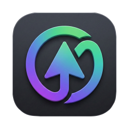
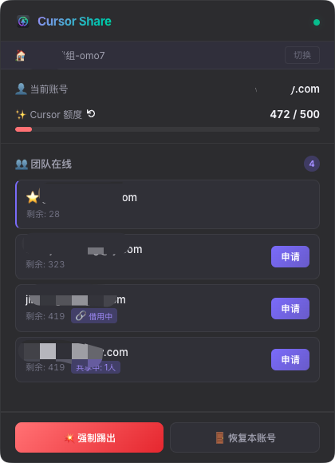
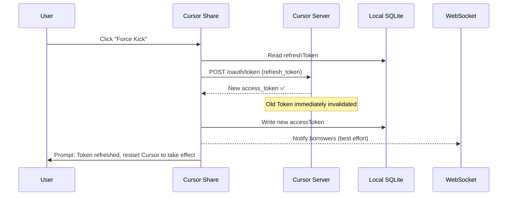

<p align="center">
  
</p>

<h1 align="center">Cursor Share</h1>

<p align="center">
  <b>Team Cursor AI Quota Sharing Tool — Securely and efficiently share Cursor usage quota among team members.</b>
</p>

<p align="center">
  <a href="README_zh.md">🇨🇳 中文文档</a>
</p>

<p align="center">
  
</p>

## ✨ Features

### 🏠 Room Isolation
- Create independent rooms with private sharing spaces for each team
- Room code + password dual verification to prevent unauthorized access
- Support for creating / joining / switching between different team rooms

### 🔐 End-to-End Encrypted Transfer
- Borrower generates an RSA key pair locally when initiating a request
- Lender encrypts the Token using the borrower's **public key** before WebSocket transfer
- Only the borrower's **private key** can decrypt — servers and intermediaries cannot access the plaintext Token

### 🔄 One-Click Borrow / Return
- **Auto backup**: Your original Token is automatically saved before borrowing
- **Auto restore**: One-click restore of your original account when returning
- **Seamless switch**: Takes effect after restarting Cursor, no re-login needed

### 🛡️ Force Kick (Real Token Refresh)
- Calls Cursor's official Token Refresh API to refresh the Token
- Old Token **immediately invalidated on Cursor servers** — even if the borrower is offline or has closed the app
- Online borrowers are notified to restore their own account
- Can be triggered from the room, tray menu, or any other location

### 📊 Real-Time Quota Monitoring
- Real-time display of team members' remaining usage (auto-refreshes every 5 minutes)
- Manual refresh button to check latest quota anytime
- Progress bar visualization of quota consumption

### 🖥️ Cross-Platform Support
- macOS (`.dmg` installer)
- Windows (`.exe` installer / NSIS setup wizard)
- Resides in the tray, doesn't take up taskbar space

---

## 🔒 Security Mechanism

Cursor Share's core design principle: **Token never passes through any third party in plaintext.**

```
┌──────────────────────────────────────────────────────────────────┐
│                    Secure Transfer Flow                          │
│                                                                  │
│  Borrower (Alice)                    Lender (Bob)                │
│  ─────────────────                ─────────────────              │
│  1. Generate RSA key pair          5. Encrypt own Token          │
│     publicKey + privateKey            with Alice's public key    │
│                                                                  │
│  2. Send request + publicKey ──────▶  Receive request            │
│                                   3. Popup: Approve/Reject       │
│                                   4. Click "Approve"             │
│                                                                  │
│  7. Decrypt with privateKey ◀────── 6. Send encrypted Token      │
│  8. Write to local Cursor DB                                     │
│  9. Restart Cursor to activate                                   │
│                                                                  │
│  ⚠️ Server only relays encrypted data, cannot decrypt Token      │
└──────────────────────────────────────────────────────────────────┘
```

### Token Lifecycle Management

| Phase | Security Measure |
|---|---|
| **Transfer** | RSA public key encryption, invisible to server |
| **Storage** | Token only written to local SQLite, never uploaded |
| **Server** | Pure in-memory operation, no database, stores nothing, cleared on restart |
| **Backup** | Original Token automatically backed up locally before borrowing |
| **Revocation** | Calls Cursor's official API to refresh Token, old Token invalidated server-side |
| **Restore** | One-click restore of original Token, also available from tray menu |

---

## 🔁 Complete Usage Flow

```mermaid
flowchart TD
    A[Launch Cursor Share] --> B{First time?}
    B -->|Yes| C[Create room → Get room code + password]
    B -->|No| D[Join existing room]
    C --> E[📋 Copy room info to share with team]
    E --> F[Enter room]
    D --> F

    F --> G[View team online members and quota]

    G --> H{Need quota?}
    H -->|Yes| I[Click "Borrow" to request quota]
    I --> J[Other party receives notification: Approve/Reject]
    J -->|Approve| K[Token encrypted transfer → Written locally]
    K --> L[Restart Cursor to activate]

    H -->|No| M{Someone borrowing your quota?}
    M -->|Yes| N{Need to revoke?}
    N -->|Yes| O[Force Kick → Refresh Token → Old Token invalidated]
    N -->|No| P[Continue sharing]

    L --> Q[Done → Restore your account]
    Q --> R[Original Token written back → Restart Cursor]
```

### Force Kick Flow



---

## 🚀 Quick Start

### 1. Start the Backend Service

The backend only needs to be deployed on **one server** (recommended: cloud server accessible to all team members).

> 💡 The backend is a **pure signaling relay service** — no database, no stored user data. All state exists only in memory and is cleared on restart.

```bash
cd backend
npm install
npm start
```

After starting, the LAN address will be displayed:
```
╔══════════════════════════════════════════════════════════════╗
║   Cursor Share Signaling Server  v2.0                       ║
║   LAN:    ws://192.168.1.100:8080                           ║
╚══════════════════════════════════════════════════════════════╝
```

### 2. Start the Client

Each team member runs on their own computer:

```bash
cd frontend
npm install
npx -y @electron/rebuild   # Compile better-sqlite3 native module
npm start
```

### 3. Connect and Use

1. Enter the backend address in the "Server Address" field (e.g. `ws://120.48.12.81:8080`)
2. **Create Room**: Enter team name → Generate room code and password → Copy and share with team
3. **Join Room**: Enter room code + password → Enter room
4. View team member online status and quota → Initiate borrow request

---

## 📦 Build & Distribute

Generate distributable installers:

```bash
cd frontend

# macOS
npm run dist:mac    # Generate .dmg

# Windows
npm run dist:win    # Generate .exe installer

# All platforms
npm run dist
```

Build output is in the `frontend/dist/` directory.

---

## 📁 Project Structure

```
cursor-share/
├── backend/                  # WebSocket signaling server (no database, pure memory)
│   └── src/
│       ├── server.js            # Entry point, WS connection management
│       ├── handlers.js          # Message handling logic
│       ├── state.js             # In-memory state management (not persisted)
│       ├── broadcast.js         # Broadcast utilities
│       └── heartbeat.js         # Heartbeat detection
├── frontend/                 # Electron desktop client
│   ├── main.js                  # Main process (Tray, IPC, Window)
│   ├── preload.js               # Security bridge (Context Bridge)
│   ├── renderer/
│   │   ├── index.html           # UI structure
│   │   ├── styles.css           # Styles (dark theme)
│   │   └── app.js               # Renderer process logic
│   ├── lib/
│   │   ├── i18n.js              # Internationalization (en/zh)
│   │   ├── sqlite-ops.js        # SQLite CRUD + Token backup/restore
│   │   └── cursor-api.js        # Cursor API (quota query + Token refresh)
│   └── assets/                  # Icon resources (.png, .icns)
└── README.md
```

---

## 🌐 Internationalization

Cursor Share supports **English** (default) and **Chinese**. The language is automatically detected from your system locale. All UI elements, dialogs, notifications, and tray menus are translated.

---

## 💻 System Requirements

- **Node.js** ≥ 18
- **Cursor** installed and logged in
- Team members must have access to the backend server (same LAN or public server)

---

## ❓ FAQ

**Q: `npm install` fails on Windows?**
A: You need to install C++ build tools: `npm install --global windows-build-tools`

**Q: "Database file not found" error on startup?**
A: Make sure Cursor is installed and you've logged in at least once. Database path:
- macOS: `~/Library/Application Support/Cursor/User/globalStorage/state.vscdb`
- Windows: `%APPDATA%\Cursor\User\globalStorage\state.vscdb`

**Q: Can't connect to the server?**
A: Check if your firewall allows port 8080. If using a cloud server, make sure the security group has the port open.

**Q: Can the borrower still use it after Force Kick?**
A: No. Force Kick calls Cursor's official API to refresh your Token. The old Token is immediately invalidated on Cursor servers, regardless of whether the borrower is online or not.

**Q: Can the server see the Token?**
A: No. The Token is encrypted with the borrower's RSA public key locally before transfer. The server only relays encrypted data and cannot decrypt it.
